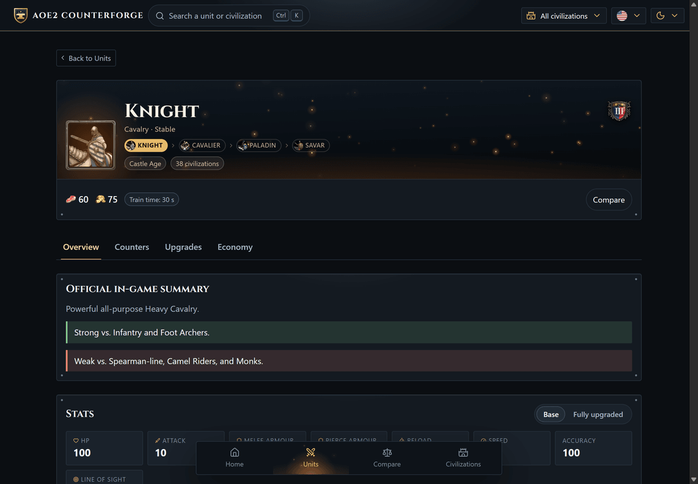
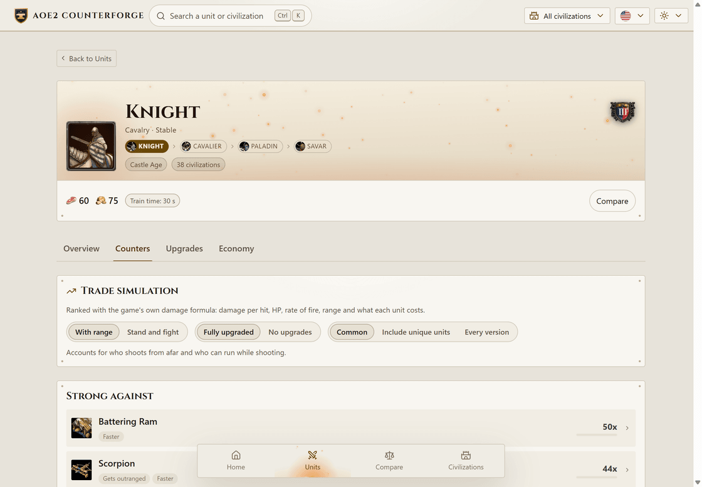
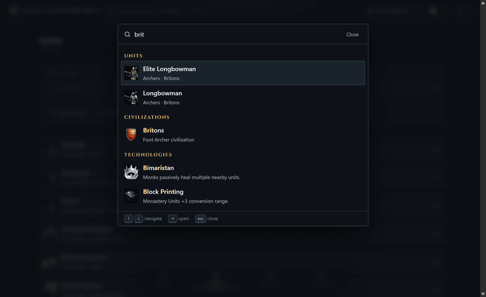

<div align="center">


<h1>AoE2 Counterforge</h1>

<p><strong>Counters, custos, melhorias e economia de todas as unidades de Age of Empires II: Definitive Edition.</strong><br>
Os números saem do jogo instalado, ficam versionados no repositório e o app roda inteiro sem rede.</p>

<p>


</p>



</div>

## O que ele responde

- **Contra quem ela é boa e contra quem é ruim** — ranking calculado com a fórmula de dano do
  próprio jogo, não uma tabela escrita à mão, com a lista completa de confrontos por trás de um
  filtro de amplitude.
- **Quanto custa e quais são os atributos** — custo, tempo de treino, PV, ataque, armaduras,
  alcance, cadência, velocidade e dano bônus por classe.
- **Quais melhorias afetam ela** — evoluções da linha, tecnologias genéricas com o efeito
  numérico aplicado, e as tecnologias exclusivas de cada civilização que mexe na unidade.
- **Quantos aldeões são necessários para produzi-la sem parar** — por recurso, considerando o
  número de construções, a fonte de comida, as melhorias de coleta, de transporte e de fazenda,
  além da madeira gasta para refazer as fazendas.

Cada unidade também lista **todas as civilizações que a treinam**, com atalho para a página de
cada uma. E dá para colocar **até quatro unidades lado a lado**, com os atributos alinhados e uma
matriz de confronto direto entre elas.

A lista de unidades ordena por qualquer atributo — mais rápida de treinar, mais barata, mais PV,
maior dano por segundo, melhor custo-benefício — com filtro por nome, tipo, época, e opções para
mostrar só exclusivas, uma unidade por linha de evolução, ou contar as melhorias nos números.

A busca é um command palette (`Ctrl`/`Cmd` + `K`) que entende unidade, civilização e tecnologia,
com correspondência aproximada, sem acentos, em português e inglês. Escrever `bretões arqueiro`
filtra o resultado para o arsenal dos Bretões.

<table>
<tr>
<td width="50%" valign="top">

<p align="center"><sub><b>Counters</b> · simulação de troca com alcance, kiting e custo, nos dois temas</sub></p>
</td>
<td width="50%" valign="top">

<p align="center"><sub><b>Ctrl</b>+<b>K</b> · busca aproximada, sem acentos, em unidade, civilização e tecnologia</sub></p>
</td>
</tr>
</table>

## Stack

| Peça | Escolha |
| --- | --- |
| Build | Vite 8 (Rolldown é o bundler padrão desta versão) |
| UI | React 19 + React Router 8 (hash router, hospedagem estática sem configuração) |
| Linguagem | TypeScript em modo estrito |
| i18n | i18next + react-i18next (pt-BR e en) |
| Testes | Vitest 4 (unit, feature, arch) + Testing Library |
| Lint | ESLint 10 flat config + typescript-eslint com checagem de tipos |
| Estilo | CSS puro com design tokens, sem framework |

## Começando

```bash
npm install
npm run dev
```

O dataset e os ícones já estão versionados, então não é preciso rede para rodar o app.

### Scripts

| Comando | O que faz |
| --- | --- |
| `npm run dev` | Servidor de desenvolvimento |
| `npm run build` | Checagem de tipos + build de produção |
| `npm run preview` | Serve o build |
| `npm test` | Roda a suíte inteira |
| `npm run test:coverage` | Suíte com cobertura (limites configurados em `vitest.config.ts`) |
| `npm run lint` | ESLint com checagem de tipos |
| `npm run typecheck` | Só o compilador |
| `npm run data:build` | Regera `src/data/generated/` a partir da instalação do jogo |
| `npm run data:icons` | Extrai da instalação só os ícones que o dataset referencia |

## Arquitetura

A regra central: **a lógica não sabe que o React existe**. Ela vive em classes puras e o React
consome tudo através de hooks-adaptadores.

```
src/
  domain/        entidades e objetos de valor (Unit, UnitStats, ResourceCost, AttackProfile...)
  services/      uma pasta por capacidade, cada uma com um único *-service.ts de entrada
  data/          dataset gerado + tipos dos registros
  composition-root.ts   monta o grafo de serviços
  react/
    providers/   contextos (serviços, preferências, command palette)
    hooks/       adaptadores finos: useMatchups, useProductionPlan, useUnitSearch...
    components/  apresentação
    pages/       rotas (início, unidades, unidade, comparar, civilizações, tecnologia, sobre)
  i18n/          textos da interface
```

Serviços:

| Serviço | Responsabilidade |
| --- | --- |
| `GameCatalogService` | Única porta de leitura do dataset (unidades, civilizações, tecnologias) |
| `GameTextService` | Nomes e descrições localizados |
| `CombatService` | Dano por golpe, DPS, golpes e tempo para matar, duelo |
| `MatchupService` | Ranking de counters com eficiência de troca |
| `UnitRankingService` | Ordena o acervo por atributo, dano por segundo ou custo-benefício |
| `UpgradeService` | Quais tecnologias afetam a unidade e como ficam os atributos |
| `EconomyService` | Aldeões por recurso para manter a produção contínua |
| `SearchService` | Índice de busca por locale, escopo por civilização |

Três regras são verificadas automaticamente, não apenas combinadas:

- `eslint.config.js` proíbe `import` de React (ou de `src/react/`) dentro de `domain/` e
  `services/`, e proíbe `window`/`document` nessas camadas.
- `tests/arch/layering.test.ts` confere as mesmas fronteiras lendo os arquivos, e ainda garante
  que todo serviço mora em `services/<domínio>/<domínio>-service.ts`.
- Todo construtor de classe recebe um único objeto de configuração tipado, com as dependências
  injetadas pelo composition root.

## De onde vêm os dados

Tudo o que o app mostra é extraído do próprio jogo instalado. O dataset fica **versionado** em
`src/data/generated/`, então o app roda offline e não consulta nada em tempo de execução.

Para regerar, copie `.env.example` para `.env` e aponte `AOE2_GAME_ROOT` para a pasta da
instalação — aquela que contém `resources/` e `widgetui/`. O `.env` não é versionado; a variável
também vale direto no ambiente, se preferir.

```bash
cp .env.example .env
npm run data:build
npm run data:icons
```

Os scripts são TypeScript rodando em `vite-node`, sem etapa de build. Eles leem:

| Arquivo da instalação | O que sai dali |
| --- | --- |
| `resources/_common/dat/empires2_x2_p1.dat` | atributos, custos e tempos de unidades e tecnologias |
| `resources/_common/dat/CivTechTrees/*.json` | disponibilidade, época e edifício de cada nó, por civilização |
| `resources/_common/dat/civilizations.json` | lista de civilizações |
| `resources/<idioma>/strings/key-value/` | nomes e descrições oficiais em pt-BR e inglês |
| `widgetui/textures/` | ícones de unidade, tecnologia e civilização |
| `widgetui/textures/menu/` | escudos de época, moldura do retrato e ícones de recurso |

O `.dat` é um binário comprimido e sem índice: `scripts/extract/binary-reader.ts` percorre os
campos na ordem exata em que o jogo os grava e `scripts/extract/genie-dat.ts` valida cada seção
antes de seguir para a próxima.

Os ícones vêm em DDS (parte deles comprimidos em BC1/BC3). O `texconv.exe` que o próprio jogo
distribui em `Tools_Builds/` decodifica a textura no tamanho original e `scripts/extract/image.ts`
faz o resto.

A primeira etapa é a cor do jogador. A textura de um ícone é opaca de ponta a ponta, então
transparência nela significa outra coisa: marca a parte da unidade que pertence ao jogador — a
túnica do Milícia, as listras do Cavaleiro — e o cinza guardado ali é o sombreamento com que
pintá-la. O jogo resolve isso ao desenhar; uma imagem numa página precisa resolver antes, e o
guia pinta tudo com o azul do primeiro jogador.

As texturas de unidade e tecnologia são todas de 256 px e é assim que elas são gravadas — inteiras,
sem nenhuma média de pixel pelo caminho. O que segura o peso é a codificação: o `sharp` (usado só
na extração) reduz cada ícone a uma paleta de 256 cores, o que aqui não muda nada visível, porque
a arte é um recorte pequeno de um modelo renderizado. Custa menos da metade de gravar canal a
canal. O emblema de civilização vem de um PNG de 104 px e é apenas recodificado.

Se uma textura for menor que o alvo — não é o caso hoje — ela é reduzida pela média da área que
cada pixel cobre, e recebe de volta a definição de borda que a redução tira.

O resultado:

- atributos e custos de 226 unidades e 192 tecnologias;
- disponibilidade por civilização derivada das 53 árvores tecnológicas;
- nomes e descrições oficiais em **pt-BR e inglês**, incluindo as frases "Forte contra…" e
  "Fraco contra…" escritas pelos designers do jogo;
- a tabela de efeitos do jogo: cada tecnologia carrega os comandos que ela dispara — atributo,
  modo (somar, definir, multiplicar), valor e a unidade ou classe atingida. É o que responde quais
  tecnologias mexem numa unidade e de quanto, sem nenhuma regra escrita à mão: 121 das 192
  tecnologias têm efeito modelável;
- os **bônus de civilização como número**, e não como frase. O jogo implementa cada bônus passivo
  como uma tecnologia presa àquela civilização e pesquisada de graça no início da partida — é por
  isso que ela não tem nome. Descartando tudo o que aparece em alguma árvore tecnológica e o bônus
  de equipe, sobram 1.229 efeitos em 44 das 53 civilizações. É o que faz o Paladino dos Francos
  mostrar 192 PV em vez de 180, e o arqueiro dos Bretões alcançar 3 a mais;
- linhas de evolução reconstruídas a partir dos vínculos de upgrade;
- entradas duplicadas fundidas: várias unidades existem duas vezes no jogo por serem treináveis
  em um segundo edifício (Donjon, Krepost, Estábulo), e o guia mostra uma entrada só listando
  os dois lugares.

`tests/feature/extract/game-install.test.ts` refaz a extração e compara com o dataset versionado;
ele só roda quando `AOE2_GAME_ROOT` está definido.

## Aparência

Ferro e ouro sobre aço azulado, nos dois temas, com a matéria vindo do próprio jogo: os quatro
escudos de época e a moldura de encaixe do retrato saem de `widgetui/textures` pelo mesmo script
dos ícones. O resto da forja é desenhado no cliente:

| Peça | Como é feita |
| --- | --- |
| Chapa martelada nas barras | um ladrilho de 96 px sorteado no carregamento, sem arquivo |
| Rebites nos cantos dos cards | quatro `radial-gradient` |
| Luz correndo na borda dourada | um degradê estreito com `blur`, sem canvas |
| Fogo sob a aba aberta | `feTurbulence` deslocando um degradê quente, preso à célula |
| Halo do retrato | respiração de 4,6 s com tremor de calor por `feDisplacementMap` |
| Brasas subindo no banner e na aba | `EmberField`, um canvas de partículas com vento senoidal |

A lógica das brasas é uma classe sem React em `src/react/effects/ember-field.ts`, adaptada por
`useEmberField`. Nada disso roda com `prefers-reduced-motion: reduce`.

Os ícones de interface são do **Lucide**; os títulos, em **Cinzel**, que viaja junto com o app
(licença OFL em `src/react/styles/fonts/`) para o guia continuar funcionando sem rede.

A marca é desenhada à mão em `public/brand.svg`: um brasão de escudo com bigorna e fagulhas, ouro
sobre aço, no mesmo vocabulário da forja. O mesmo arquivo serve de logotipo no cabeçalho e de ícone
da aba — a identidade é nossa, sem arte do jogo.

## Como os counters são calculados

1. **Dano por golpe** usa a fórmula do jogo: para cada classe de armadura que os dois lados
   compartilham, ataque menos armadura; soma tudo; mínimo de 1 de dano. Armadura negativa
   aumenta o dano, como no jogo.
2. **DPS** aplica a precisão para unidades de longo alcance e divide pela recarga. Uma precisão
   registrada como zero (Rabadoquim, Granadeiro, navios de fogo) significa que o jogo resolve
   aquele projétil por um caso especial, não que a unidade erra sempre, então ela é lida como
   100%. Unidades de uso único, com recarga zero, não têm DPS sustentado.
3. **Alcance** entra como exposição: quem é superado em alcance passa parte do combate sem poder
   responder, proporcional ao tempo de aproximação. Quem também é mais lento leva a penalidade de
   kiting.
4. **Eficiência de troca** compara quanto valor cada lado destrói por segundo, com ouro e pedra
   pesando mais que comida e madeira.

A amplitude da lista é escolhida na tela:

| Filtro | O que entra |
| --- | --- |
| Comuns | Um representante por linha, só o que a maioria das civilizações treina (~11 adversários) |
| Incluir exclusivas | Um representante por linha, agora com as unidades exclusivas (~95) |
| Todas as versões | Cada degrau de cada linha separadamente (~190) |

A eficiência é limitada a 99x para manter a ordenação estável; menos de 1% dos pares chega lá.

O resultado é sempre mostrado ao lado do resumo oficial do jogo, e o detalhamento do dano fica
a um toque de distância em cada confronto.

**Limites do modelo:** é uma simulação de uma unidade contra uma. Ela não modela batalhas em
massa, foco de fogo, dano em área sobre grupos, conversões de monge nem micro perfeito. Unidades
que só servem para derrubar construções (Trabuco, Petardeiro) ficam fora do ranking, e unidades
sem ataque (Monge) mostram uma explicação no lugar da simulação.

## Como a economia é calculada

<p align="center">

</p>

Consumo por segundo = custo × construções ÷ tempo de treino. Aldeões por recurso = consumo ÷ taxa
de coleta.

A taxa de coleta sai de um modelo de viagem em vez de um número fixo. As taxas publicadas do
Definitive Edition já incluem a caminhada até o depósito, então o app faz o caminho inverso:
sabendo a carga (10) e a velocidade do aldeão (0,8 tile/s), separa quanto da viagem é coleta e
quanto é caminhada. Com isso cada melhoria entra onde ela realmente age:

- **Coleta** (Machado Duplo, Serra em Arco, Serra de Dois Homens, Mineração de Ouro e de Pedra)
  multiplica a velocidade de trabalho, exatamente na porcentagem que o jogo declara.
- **Transporte** (Carrinho de Mão, Carroça de Mão) aumenta carga e velocidade de caminhada; o
  ganho resultante fica na casa dos 8% e 18%, sem precisar de nenhum número inventado.
- **Arado Forte** dá +1 de carga só para quem está na fazenda.
- **Fazendas** (Cabresto, Arado Forte, Rotação de Culturas) aumentam a comida por fazenda, e o app
  usa isso para calcular a **madeira gasta refazendo fazendas** — um Cavaleiro não custa madeira,
  mas produzir Cavaleiros sem parar exige lenhadores mesmo assim.

Conscrição também é alternável, acelerando o treino em 33%.

## Créditos

Age of Empires II, seus dados e seus ícones pertencem à Microsoft, Forgotten Empires, Ensemble
Studios e SkyBox Labs. Este é um projeto de fã, sem vínculo oficial e sem fins comerciais.

Ícones de interface: [Lucide](https://lucide.dev), licença ISC. Tipografia: Cinzel, licença SIL
Open Font License 1.1.
