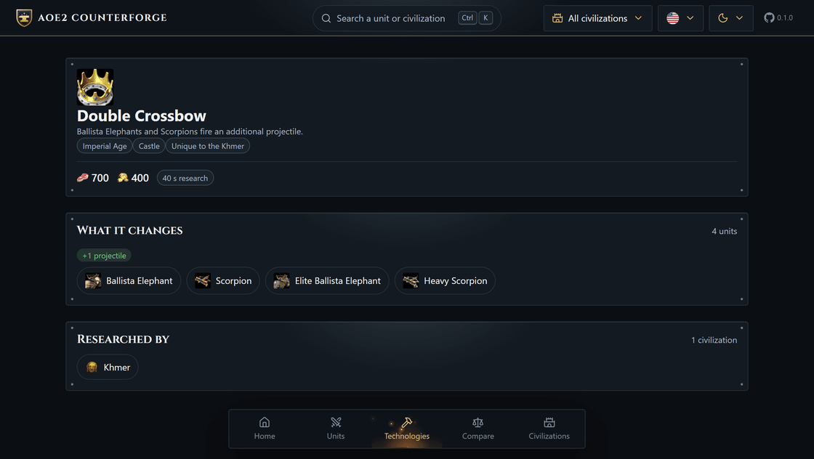

<p align="center">
  
</p>

<h1 align="center">AoE2 Counterforge</h1>

<p align="center">
  <strong>A unit guide for Age of Empires II: Definitive Edition.</strong><br>
  What beats it, what it costs, which upgrades touch it, and how many villagers keep it coming.
</p>

<p align="center">
  <a href="https://github.com/giovani-freitag/aoe2-counterforge/actions/workflows/ci.yml"></a>
  
  &nbsp;·&nbsp;
  
  
  
  
</p>

<p align="center">
  <a href="https://giovani-freitag.github.io/aoe2-counterforge/"><strong>Open the guide →</strong></a>
</p>

<p align="center">
  
</p>

---

Pick a unit and get an answer, not a wiki page. The counters are **computed from the game's own
damage formula** every time you open them, so they follow the civilization you picked, the upgrades
you have, and whether you plan to stand and fight or shoot on the move.

## ✨ Features

- ⚔️ **Counters that are calculated** — damage per hit, DPS, range exposure and kiting, weighted by what each side costs, with the fight capped where one side stops being able to answer. Not a hand-written table.
- 🛡️ **Every upgrade that touches the unit**, read from the game's effect table, with the number it changes and the total once everything is researched.
- 🔨 **A page per technology** — what it costs, every unit it changes and by how much, and which civilizations get to research it.
- 🏰 **Civilization-aware** — pick one and every stat, counter and ranking follows what it can research *and* the bonuses it is simply given.
- 👥 **Villagers per resource** to keep a building producing non-stop, with the bottleneck called out.
- ⚖️ **Four units side by side**, best value crowned on every row, plus a head-to-head matrix.
- 🔎 **`Ctrl`/`Cmd` + `K`** across units, civilizations and technologies — fuzzy, accent-blind, in English and Portuguese.
- 📴 **Works offline.** The whole dataset ships with the page; nothing is fetched at runtime.

<table>
<tr>
<td width="50%" valign="top">

<p align="center"><sub>Counters, in either theme</sub></p>
</td>
<td width="50%" valign="top">

<p align="center"><sub>One palette, every kind of result</sub></p>
</td>
</tr>
<tr>
<td width="50%" valign="top">

<p align="center"><sub>Every technology, and what it actually does</sub></p>
</td>
<td width="50%" valign="top">

<p align="center"><sub>Mobile first, not mobile last</sub></p>
</td>
</tr>
</table>

## 🚀 Run it locally

```sh
npm install
npm run dev
```

No game install, no API key, no network — the data is in the repository.

## 📚 Docs

- **[How the counters are calculated](docs/counters.md)** — the formula, the assumptions and the limits.
- **[How the economy is calculated](docs/economy.md)** — gather rates as trips, and where each upgrade lands.
- **[Where the data comes from](docs/data.md)** — reading the game files, and how to regenerate.
- **[Architecture decisions](docs/adr/)** — the rules this codebase is held to.

---

MIT licensed. Age of Empires II, its data and its artwork belong to Microsoft, Forgotten Empires, Ensemble Studios
and SkyBox Labs. This is a fan project, unaffiliated and non-commercial. Interface icons by
[Lucide](https://lucide.dev) (ISC); Cinzel under the SIL Open Font License 1.1.
