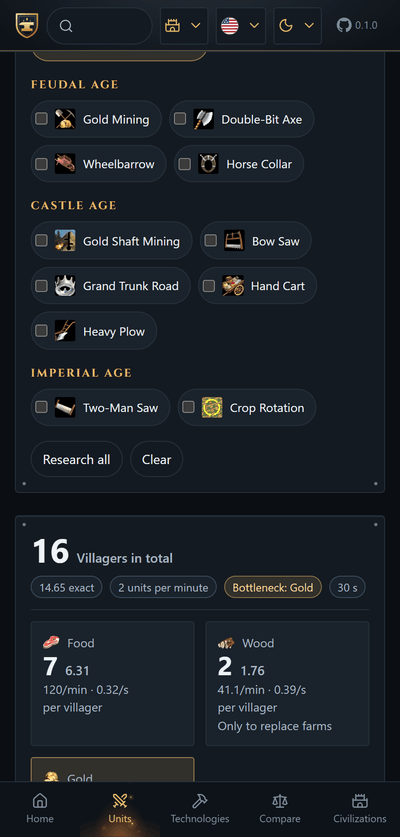

# How the economy is calculated

  

The question the tab answers is: to keep this unit coming out of its building without a pause, how
many villagers do you need, and on what?

Consumption per second is the unit cost times the number of production buildings, divided by its
train time. Villagers per resource is that consumption divided by the gather rate.

Every technology figure here is read from the game's own effect table, the same one the counters
use — including the ones a hand-written list forgets, such as Grand Trunk Road. What is still set
by hand is the pair the file does not state: the effective gather rates below, measured with the
walk included, and the villager's carry capacity of ten.

## The gather rate is a trip, not a constant

The rate a villager gathers at and the load it carries away are both read from the game's own unit
records — one record per kind of work, so the forager, the hunter and the lumberjack each state
their own. The hunter carries a whole boar, thirty-five at a time against everyone else's ten, and
that is why it walks a third as often.

What the game does not state is how far the walk is. That distance is the only invented number in
the economy, it lives with the rest of the guide's assumptions under one roof, and each value there
carries the sentence that justifies it. A trip is therefore the time to fill up plus the time to
walk there and back, and the rate the guide reports is a load divided by that trip — always lower
than the rate at the resource, because the walk is real.

The published Definitive Edition rates already include walking to the drop-off point, so the app
works backwards: knowing the carry capacity (10) and the villager's walking speed (0.8 tiles/s), it
separates how much of a trip is gathering from how much is walking. That is what lets every upgrade
land where it actually acts:

- **Gathering** (Double-Bit Axe, Bow Saw, Two-Man Saw, Gold and Stone Mining, Grand Trunk Road)
  multiplies the work rate, by exactly the factor the game states, for exactly the job it names —
  the game keeps one villager unit per job, and that is what says whether a technology is about
  wood, gold, stone or a particular way of getting food.
- **Carrying** (Wheelbarrow, Hand Cart) raises capacity and walking speed; the resulting gain works
  out to around 8% and 18%, with no invented numbers.
- **Heavy Plow** adds +1 to the carry capacity of farmers only.
- **Farm upgrades** (Horse Collar, Heavy Plow, Crop Rotation) raise the food per farm, which the app
  uses to work out the **wood spent rebuilding farms** — a Knight costs no wood, but producing
  Knights non-stop still needs lumberjacks.

Conscription can be toggled on, cutting the train time by 33%.

The result is shown as a whole number of villagers per resource, with the exact figure beside it,
plus the bottleneck: the resource that runs out first and therefore sets the pace.
